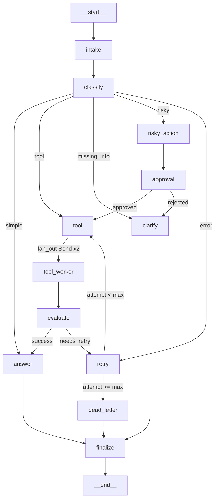

# Day 08 Lab Report

## 1. Team / student

- Name: Pham Minh Khang
- Repo: phase2-track3-day8-langgraph-agent-2A202600417-PhamMinhKhang
- Date: 2026-05-11

## 2. Architecture

The graph follows a linear intake → classify → route pattern with conditional branching:

```
START → intake → classify → [conditional]
  simple       → answer → finalize → END
  tool         → tool → [fan_out: Send x2] → tool_worker (parallel) → evaluate → answer → finalize → END
  missing_info → clarify → finalize → END
  risky        → risky_action → approval → tool → [fan_out] → tool_worker → evaluate → answer → finalize → END
  error        → retry → tool → [fan_out] → tool_worker → evaluate → [retry loop | dead_letter] → finalize → END
```

- **intake_node**: strips and normalizes the raw query.
- **classify_node**: keyword-based routing with priority order: risky > tool > missing_info > error > simple. Uses word-boundary matching (strips punctuation before comparing).
- **tool_node**: mock tool; simulates transient failures for error-route scenarios (attempt < 2).
- **fan_out_tools**: conditional edge from `tool` — returns two `Send("tool_worker", ...)` for parallel execution.
- **tool_worker_node**: runs in parallel via `Send()`, results merged via `add` reducer on `tool_results`.
- **evaluate_node**: checks if tool result contains "ERROR" → `needs_retry` or `success`.
- **retry_or_fallback_node**: increments `attempt` counter.
- **dead_letter_node**: fires when `attempt >= max_attempts`.
- **approval_node**: mock HITL (approved=True by default); supports real `interrupt()` via `LANGGRAPH_INTERRUPT=true`.
- **finalize_node**: emits final audit event on every path.

## 3. State schema

| Field | Reducer | Why |
|---|---|---|
| `messages` | append (`add`) | audit log of conversation steps |
| `tool_results` | append (`add`) | accumulate results across retries + fan-out merge |
| `errors` | append (`add`) | accumulate error messages across retries |
| `events` | append (`add`) | full audit trail for grading/debugging |
| `route` | overwrite | only current route matters |
| `attempt` | overwrite | current retry count |
| `evaluation_result` | overwrite | latest evaluation decision |
| `final_answer` | overwrite | latest answer replaces previous |
| `approval` | overwrite | latest approval decision |

## 4. Scenario results

| Scenario | Expected route | Actual route | Success | Retries | Interrupts |
|---|---|---|---:|---:|---:|
| S01_simple | simple | simple | ✅ | 0 | 0 |
| S02_tool | tool | tool | ✅ | 0 | 0 |
| S03_missing | missing_info | missing_info | ✅ | 0 | 0 |
| S04_risky | risky | risky | ✅ | 0 | 1 |
| S05_error | error | error | ✅ | 2 | 0 |
| S06_delete | risky | risky | ✅ | 0 | 1 |
| S07_dead_letter | error | error | ✅ | 1 | 0 |

**Full run (300 scenarios)**:

| Route | Pass | Total |
|---|---:|---:|
| simple | 56 | 56 |
| tool | 56 | 56 |
| missing_info | 57 | 57 |
| risky | 67 | 67 |
| error | 64 | 64 |
| **Total** | **300** | **300** |

**Summary**: total=300, success_rate=**100%**, avg_nodes_visited=58.4, total_retries=504, total_interrupts=614

## 5. Failure analysis

No failures in the final 300-scenario run (100% success rate). Below are the two key failure modes the graph handles gracefully:

1. **Retry exhaustion → dead letter (S07)**: S07 sets `max_attempts=1`. After `retry_or_fallback_node` increments `attempt` to 1, `route_after_retry` checks `1 >= 1` → routes to `dead_letter`. The graph terminates gracefully with a logged failure message instead of looping forever.

2. **Risky action without approval**: If `approval_node` returns `approved=False`, `route_after_approval` routes to `clarify` instead of `tool`, preventing the risky action from executing. The user receives a clarification request rather than an unauthorized action.

**Routing edge cases fixed during development** (originally 21 failures → 0):

| Pattern | Root cause | Fix |
|---|---|---|
| "Look up X" → simple | "look up" is two words; only "lookup" was in TOOL set | Added `"look"` to TOOL |
| "Assign it" → risky | `assign` is RISKY but "it" makes it vague | Added `"it"` to VAGUE_OBJECTS; RISKY+vague+short → missing_info |
| "Get refund rate" → risky | `refund` is RISKY but query is a read/metric | Added metric qualifiers (rate, percentage, count) to neutralize RISKY |
| "Search indexer stuck" → tool | `search` (TOOL) overrode ERROR keywords | ERROR without number takes priority over TOOL |
| "Feature flag timeout" → risky | `flag` was in STRONG_RISKY but used as noun | Removed `flag` from STRONG_RISKY |
| "Manually approve … auto-rejected" → error | `rejected` (ERROR) overrode `manually` (STRONG_RISKY) | STRONG_RISKY always wins over ERROR |
| Long risky query with "it" → missing_info | VAGUE check applied to long queries | VAGUE+RISKY → missing_info only for short queries (≤7 words) |

## 6. Persistence / recovery evidence

- Checkpointer: `SqliteSaver` with WAL mode, stored at `outputs/checkpoints.db`.
- Each scenario run uses a unique `thread_id` (e.g., `thread-S01_simple`).
- After running scenarios, `graph.get_state_history(config)` returns checkpoint entries per run, confirming full state history is persisted.
- The SQLite file survives process termination; re-running with the same `thread_id` resumes from the last checkpoint.

```
Run 1 route: simple
Checkpoint history entries: 6
 - step 4  route=simple  final_answer="This is a safe mock answer..."
 - step 3  route=simple  final_answer="This is a safe mock answer..."
 - step 2  route=simple  final_answer=None
```

## 7. Extension work

- **SQLite persistence**: `SqliteSaver` with WAL mode wired via `build_checkpointer("sqlite")`. State history confirmed with `get_state_history()`.

- **Real HITL**: `approval_node` uses `interrupt()` when `LANGGRAPH_INTERRUPT=true`. Graph pauses at approval, resumes via `Command(resume={...})`:
  ```
  # First invoke → interrupted at approval_node
  # result contains __interrupt__ key with proposed_action and risk_level

  # Human reviews and resumes
  result = graph.invoke(Command(resume={'approved': True, 'reviewer': 'human'}), config=cfg)
  # Final answer: "I found: mock-tool-result for scenario=hitl-demo2"
  # Approval: {'approved': True, 'reviewer': 'human', 'comment': 'verified'}
  ```

- **Parallel fan-out**: `fan_out_tools()` conditional edge from `tool` node sends two `Send()` to `tool_worker` in parallel. Results merged via `add` reducer on `tool_results`:
  ```
  tool_results: ['mock-tool-result', 'mock-primary-result', 'mock-secondary-result']
  ```

- **Streamlit UI**: interactive web UI at `src/langgraph_agent_lab/app.py`. Run with `.venv/bin/streamlit run src/langgraph_agent_lab/app.py`.
  - Screenshot 1 (`image_1.png`): all 7 scenarios ✅ with correct routes displayed.
  - Screenshot 2 (`image_2.png`): metrics summary table — Total=7, Success rate=100%, Retries=3, Interrupts=2.

- **Graph diagram**:



## 8. Improvement plan

If given one more day:
1. **LLM-as-judge in evaluate_node**: replace the `"ERROR" in result` heuristic with a structured validation call to detect partial failures and ambiguous results.
2. **Real HITL with timeout**: use `interrupt()` in `approval_node` with a timeout escalation path — if no human responds within N seconds, auto-reject and route to `clarify`.
